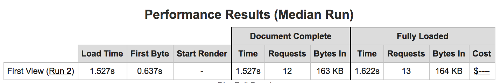

## GameDex for Web
GameDex is a web-based application that allows our users to create and manage their inventory of games. We like to think of it as “your game shelf for the modern day.” With GameDex, you can have a list of all your games in one place, no matter what kind of game it is!
[https://gamedex-2d485.firebaseapp.com/](https://gamedex-2d485.firebaseapp.com/)

## Implementation Details
To bring GameDex to life we utilized the following resources:
* Hosting: Firebase
* Database: Firebase
* Client-Side Scripting: Vanilla JavaScript
* Styling of Pages: Bootstrap

## Development History
GameDex was developed as part of UC San Diego’s Winter 2017 CSE 134B course. Throughout the process, we built upon the fundamental idea of what GameDex would one day be. We started with simply defining our app in homework 1 (see HW1_WriteUp.pdf). In this document, we detailed what users would visit our site and why, a rough wireframe concept of GameDex, and any challenges we see.

With our wireframes in mind, we took to actually writing code! We started with only writing the structural elements (no styling) and that can [be found here](../../public/wireframes). In homework 2 we also [implemented all the tags](../../public/tags) found in the HTML5 spec. Finally, we created [a fun team page](../../public/team.html) to show our development team.

It was an incredibly difficult task for us to try and move away from how a page looks and design only the structural frame of our app, so we were quite pleased when we were able to style our pages for homework 3. Homework 3 allowed us to use [vanilla CSS](../../public/vanilla) to style our pages as well as a [framework for CSS (Bootsrap)](../../public/bootstrap).

The last piece of the puzzle was to make calls to the database and perform the crucial CRUD (Create, Read, Update and Delete) operations. For homework 4 we simply implemented [a demo page](../../public/demo) that hit the requirements of the homework. We originally tried to incorporate Firebase into our wireframes, but quickly ran into a lot of issues with the steep learning curve required to fully implement the app. We took our lessons learned to come up with [our final app](../../public/final).

## Optimization
We’ve optimized our code in the following ways:
* Utilized minifying services such as JSCompress to minify our JavaScript code and cssminifier to minify our CSS
* Ensured we only had necessary images stored on our database.
* Keeping mobile users in mind during development by maintaining a simple design with light image use

## Code
We’ve tried to follow the Firebase best practices as closely as possible and by doing so have done the following things:
* Ensured we utilized a wrapper function to not pollute the global namespace
* Had one method for each function to follow SRP (single responsibility principle)
* Use meaningful variable and function names to allow for better readability

For the final submission, our file structure is as follows:
```
final
│   index.html
│   main.html
│   register.html
│   README.md
│
└───css
│   │   final.css
│   │   final.min.css
│
└───images
│   │   google_focus.png
│   │   google_normal.png
│   │   google_pressed.png
│
└───js
    │   final.js
    │   final.min.js
```

As requested in the homework write up, we’ve left the un-minified version of both CSS and JS files in the project repo. We’ve split up each type of file into its individual folder (ex: css, js, images) to allow for easier code navigation. The reasoning behind using the Google images for sign-in was to follow the design guidelines set for using the Google single-sign on.

## Performance
We performed a few baseline tests to ensure our app was efficient. That included testing from WebPageTest.org as well as our own Android device on a throttled connection.

###### WebPageTest.org
From: Dulles, VA - Galaxy S5 - Chrome - Cable



###### Android Device Tests
Throttled 3G connection load time average based on 5 runs: 1.83s
Throughout the testing of the app, we received a constant time of around 1.25s to 1.41s to complete CRUD functions. This is consistent with the time it takes to call Firebase's authentication servers and various functions related to CRUD operations.

## Modifications to Original Idea
To allow for sufficient time in completing the core requirements, we moved to remove the social aspect of our GameDex app. This means we no longer have the "friend" capability to view friends, view friends games, and the analytics portion. We recognize that this was a little over ambitious once we got to understand the difficulty with Firebase and JavaScript. Without the social components, we still feel GameDex makes sense as a "digital bookshelf" for your games instead of having to look around countless places to know if you have a game or not. You could even choose to show someone your mobile device, tablet, or desktop screen as a way of sharing and comparing with friends.

## Lingering Issues / Missing features
The site currently only supports JPEG images. It also does not have validation for ensuring the images are of a certain size. Due to a communication
failure within the group and a misunderstanding of the assignment requirements, we simply ran out of time as we had to learn the Firebase storage APIs
and implement our image Crude (asset management) in just one day.

There are also numerous quality of life features that, if given more time, we'd implement such as a more user-friendly interface, increased
data validation, and better execution of mobile styling.
